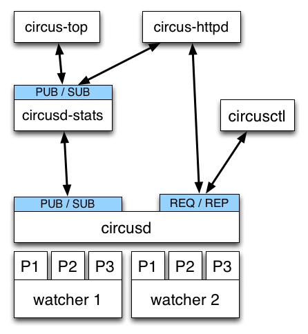
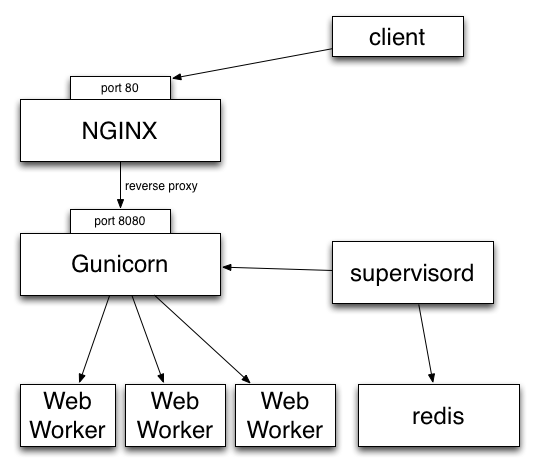
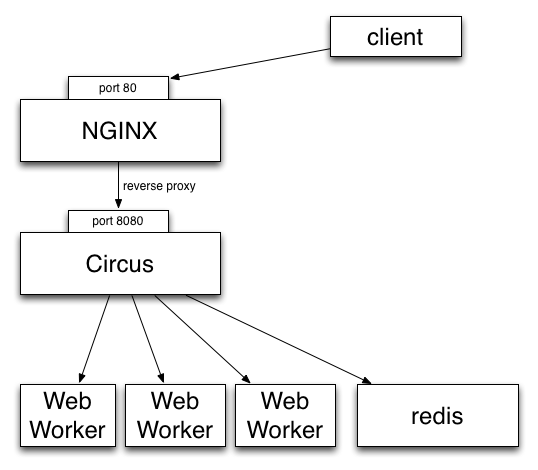
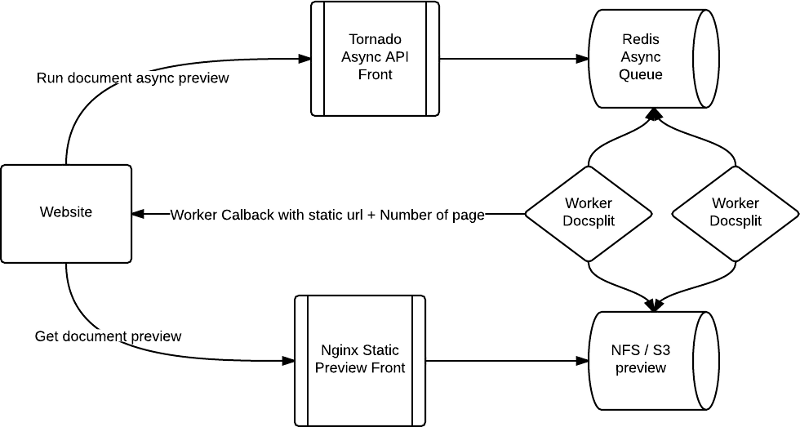

Circus - DjangoBreizh
=====================

----

.. class:: center

    **Gestionnaire de Processus & Sockets**

    Rémy Hubscher - remy.hubscher@novapost.fr - @natim

----

Gestionnaire de processus ?
===========================

- démarrer/stopper des process
- monitoring / stats
- relancer automatiquement s'il plante

Example -- stack Django:

- 1 process Gunicorn avec 4 workers Django
- 1 process Redis
- 1 process RabbitMQ
- 1 process Solr

----

Outils existants
================

- **Supervisord** -- Python, bien, APIs: XML-RPC, bonne communaute,
  dur à étendre, UI web pas terrible, pas de stdout temps reel.

- **Bluepill** -- Gestion du flapping, DSL pénible, moins mature

- **upstart** -- niveau systeme - **doit** etre root

- **daemontools** low level comme upstart, pas d'intéractions

- god, monit, runit, etc..

----

Fonctionnalités manquantes
==========================

- stdout/stderr temps reel
- stats en temps reel
- Interface Web aussi puissante que la command line
- remote
- clustering
- scalability

=> creation de Circus par Mozilla Services

----

Choix techniques
================

- Gestion des process : **psutil**
- Message passing : **ZeroMQ**
- Appli Web : **socket.io** & **Bottle** & **Gevent**
- Le reste: Pure Python

----

psutil
======

- portable (Circus pas encore)
- lenteurs fixees (> 0.6.1)
- API propre et simple

.. code-block:: python

   >>> import psutil
   >>> p = psutil.Process(7384)
   >>> p.name
   'Address Book'
   >>> p.create_time
   1346710439.681407
   >>> p.uids
   user(real=501, effective=501, saved=501)

----

ZeroMQ
======

- librairie asynchrone de messages == socket "intelligente"
- highly scalable
- transports: ITC, IPC, TCP, PGM (multicast)
- patterns principaux

 - request/reply
 - pub/sub
 - push/pull

- utilisé par IPython
- PyZMQ = bind zmq + I/O event loop adaptee de Tornado

----

Commandes
=========

- **circusd** - daemon principal
- **circus-top** - commande top-like
- **circusctl** - command-line interface
- **circushttpd** - web interface

----

Example
=======

.. code-block:: ini

    [circus]
    httpd = 1
    stats_endpoint = tcp://localhost:5557

    [watcher:django]
    cmd = bin/pserve development.ini
    singleton = 1
    working_directory = /var/myapp

    [watcher:redis]
    cmd = /usr/local/bin/redis-server /usr/local/etc/redis.conf
    singleton = 1

    [watcher:retools-workers]
    cmd = /var/myapp/bin/retools-worker main
    numprocesses = 5

Lancement : ``$ circusd webapp.ini``

----

Architecture de Circus
======================

----

Va mon fils, deploie tes applis
===============================

**DEMO** - file:///home/rhubscher/Bureau/circus/circus-screencast-1.mov

----

Stack actuelles : 2 niveaux de process...
=========================================

----

Solution avec Circus
====================

----

Les sockets Circus
==================

Comme Apache ou Gunicorn - **modele pre-fork**:

- Chaque process lancé par Circus est un child de **circusd**
- **circusd** crée les sockets et les ouvrent
- Les process enfant peuvent accepter des connections sur ces sockets
- Load balancing fait par l'OS

----

Cas concret: WSGI avec Chaussette
=================================

- **Chaussette** : Serveur WSGI pour socket déjà ouverte
- Lancement avec le file descriptor de la socket
- Socket réinstanciée avec *socket.fromfd()*
- plusieurs backends: gevent, meinheld, waitress, wsgiref, eventlet

http://chaussette.readthedocs.org

----

Example
=======

.. code-block:: ini

    [circus]
    stats_endpoint = tcp://127.0.0.1:5557
	
    [watcher:web]
    cmd = chaussette --fd $(circus.sockets.web) --backend gevent my.app
    use_sockets = True
    numprocesses = 5

    [socket:web]
    host = 0.0.0.0
    port = 8000

----

Benchmarks
==========

Du plus rapide au moins rapide:

- Circus + fastgevent
- Circus + gevent
- Circus + meinheld
- Gunicorn + gevent
- Circus + waitress

c.f. http://tinyurl.com/cykvgmo

----

Features en cours de conception
===============================

- Clustering
- Tunnelling SSH
- Streaming stderr/stdout dans l'appli web
- ...

----

Circus chez novapost
====================

----

L'example d'insight-reloaded
============================

Insight prends un document et génére des miniatures de chaque page.

https://github.com/novagile/insight-reloaded

Il est basé sur docsplit qui utilise ghostscript et openoffice.

----

L'example d'insight-reloaded
============================

----

Configuration Circus
====================

.. code-block:: ini
    
    # Tornado async server
    [watcher:insight_api]
    cmd = bin/insight_api
    numprocesses = 1
    singleton = True
    
    stdout_stream.class = FileStream
    stdout_stream.filename = /var/log/insight_api.log
    stdout_stream.refresh_time = 1
    
    stderr_stream.class = FileStream
    stdout_stream.filename = /var/log/insight_api.log
    stderr_stream.refresh_time = 1

Provisionning chef : https://github.com/novagile/insight-installer

----

Configuration Circus
====================

.. code-block:: ini
        
    # Insight docsplit worker.
    [watcher:insight_consumer]
    cmd = bin/insight
    numprocesses = 3
    copy_env = True
    copy_path = True
    
    stdout_stream.class = FileStream
    stdout_stream.filename = /var/log/insight_consummer.log
    stdout_stream.refresh_time = 1
    
    stderr_stream.class = FileStream
    stdout_stream.filename = /var/log/insight_consummer.log
    stderr_stream.refresh_time = 1

- Une interface web me monitorer/manager tous mes workers
- Si un worker crash il est automatiquement recréé

----

Configuration NGinx
===================

.. code-block:: nginx

    upstream app_server {
        # server unix:/tmp/gunicorn.sock fail_timeout=0;
        # For a TCP configuration:
        server 127.0.0.1:8888 fail_timeout=5;
    }

    server {
        listen 80 default;

        # path for static files
        set $previews_root /srv/previews;
        root $previews_root;

        location / {
            # checks for static file, if not found proxy to app
            try_files $uri @proxy_to_app;
        }

----

Configuration NGinx
===================

.. code-block:: nginx

        location /previews/ {
             alias   $previews_root;
        }

        location @proxy_to_app {
            proxy_set_header X-Forwarded-For $proxy_add_x_forwarded_for;
            proxy_set_header Host $http_host;
            proxy_redirect off;

            proxy_pass   http://app_server;
        }

        error_page 500 502 503 504 /500.html;
   }

----

Merci !
=======

Questions ?

- Docs: http://circus.io
- IRC: #mozilla-circus sur Freenode
- ML : http://tech.groups.yahoo.com/group/circus-dev/
- Novapost : http://www.novapost.fr/
